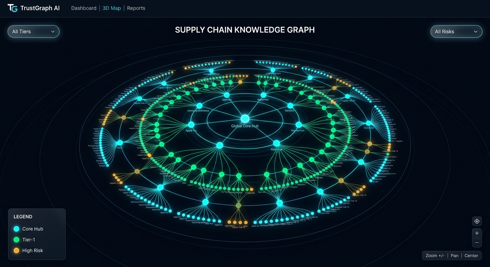
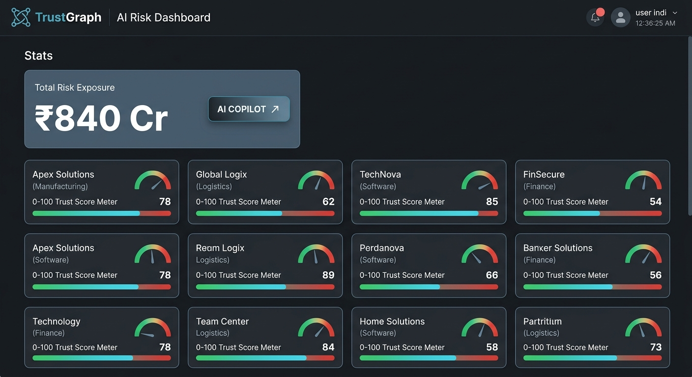
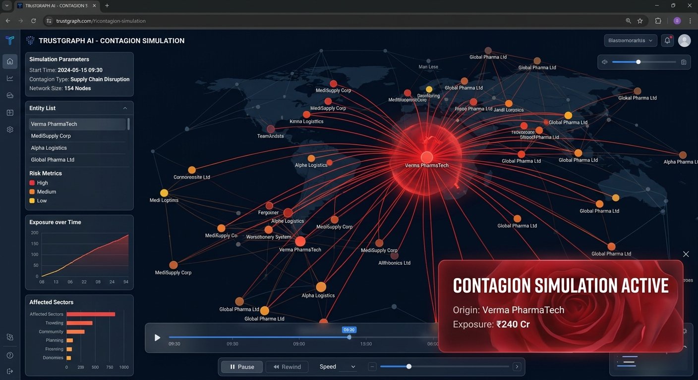

# TrustGraph AI

**Official Repository:** [https://github.com/cksakthiram2428/trust_graph_AI-version-2](https://github.com/cksakthiram2428/trust_graph_AI-version-2)

**Enterprise-Grade 3D Immersive Supply Chain Knowledge Graph & Contagion Shockwave Simulation Platform for Indian MSMEs**


*Figure 1: Immersive 3D Spatial Knowledge Graph visualizing multi-tier supplier dependencies.*

TrustGraph AI is an intelligence and risk mitigation command engine built to protect Indian MSMEs (Micro, Small, and Medium Enterprises) against multi-tier supplier defaults, delayed payments under the MSMED Act 2006, operational insolvencies, and ripple shocks across critical manufacturing supply corridors.

---

## 📊 Data Credibility & Regulatory Compliance Disclosure


*Figure 2: Comprehensive Risk Dashboard showing Trust Scores and Payment Delay analytics.*

To ensure complete regulatory integrity, legal compliance, and market credibility, TrustGraph AI strictly separates **Real-world Government Public Data** from **Algorithmically Simulated Operational Metrics**:

### 1. Real Public Government Data Sources (`dataSource: "real_registration"`)
The following fields are directly extracted and cross-referenced from verified public Indian statutory and government portals:
* **Udyam Registration Portal (Ministry of MSME / data.gov.in)**:
  * Official Enterprise Name
  * Udyam Registration Certificate Number (`UDYAM-XX-00-0000000`)
  * Enterprise Classification Category: **Micro**, **Small**, or **Medium**
  * District & State Industrial Cluster Location
  * 2-digit / 5-digit National Industrial Classification (**NIC**) Codes (e.g., NIC 2610 for Electronic Components, NIC 2100 for Pharmaceuticals)
* **Ministry of Corporate Affairs (MCA21 Portal)**:
  * Corporate Identity Number (**CIN**)
  * Company Legal Incorporation Date & Registration Status
* **GSTN Public Search**:
  * Formatted 15-character Goods & Services Tax Identification Number (**GSTIN**)

### 2. Algorithmically Simulated Risk Metrics (`dataSource: "simulated_metrics"`)
Because statutory registries (like Udyam and MCA) only maintain registration and classification metadata rather than confidential real-time banking telemetry, the following metrics are **explicitly generated via TrustGraph AI's forensic risk model**:
* **Trust Score (0–100)**: Multi-factor composite index evaluating capital concentration, geographical risk, and single-source dependency.
* **Payment Delay Averages**: Simulated historical settlement lag (e.g., `0 days avg`, `23 days avg`).
* **Delivery Fulfillment Reliability & Quality Acceptance Rates**: Simulated percentage scores indicating operational buffer resilience.
* **Open Grievance & Complaint Counts**: Modeled MSME SAMADHAAN dispute triggers.
* **Systemic Contagion Shockwaves**: Multi-tier cascading failure simulations computed via high-thinking reasoning engines.

*All UI cards and forensic audit reports prominently display the **`[Verified Udyam / MCA Entity]`** or **`[Simulated Risk Metric]`** badges to ensure full transparency.*

---

## 🚀 Key Features


*Figure 3: Real-time Contagion Shockwave Simulation modeling systemic supply chain failures.*

* **3D Multi-Tier Knowledge Graph**: Interactive Three.js concentric orbit topology visualizing Tier-0 MSME Hubs, Tier-1 Direct Partners, Tier-2 Component Fabricators, and Tier-3 Raw Material Suppliers.
* **Contagion Shockwave Simulation**: Real-time propagation engine modeling production downtime days and monetary INR exposure.
* **Multi-Turn AI Copilot (Powered by Gemini)**:
  * Switching between `gemini-3.5-flash`, `gemini-3.1-pro-preview`, and `gemini-3.1-flash-lite`.
  * **Google Search Grounding** for live market, metal, and tariff alerts.
  * **Google Maps Grounding** for industrial cluster coordinates and port bottleneck verification.
  * **High-Thinking Deep Reasoner** (`ThinkingLevel.HIGH`) for complex systemic non-linear insolvency paths.
  * **Vision Document Scanner** for extracting GSTIN, invoice amounts, and compliance flags.
  * **Live Voice API** with real-time audio interaction and text-to-speech feedback.
* **Admin CSV Ingestion Pipeline**: Ingest district-wise MSME datasets with automated validation checks (GSTIN and Udyam regex format validation).
* **Firebase Authentication & Firestore**: Secure Google sign-in and real-time database persistence.

---

## 🛠️ Data Ingestion Pipeline

To import real-world MSME CSV datasets from data.gov.in via the command line:

```bash
# Execute the MSME ingestion script
node backend/scripts/importMsmeData.js path/to/udyam_dataset.csv
```

Or use the **Ingest Udyam CSV** button directly inside the **Supplier Grid** admin view.
