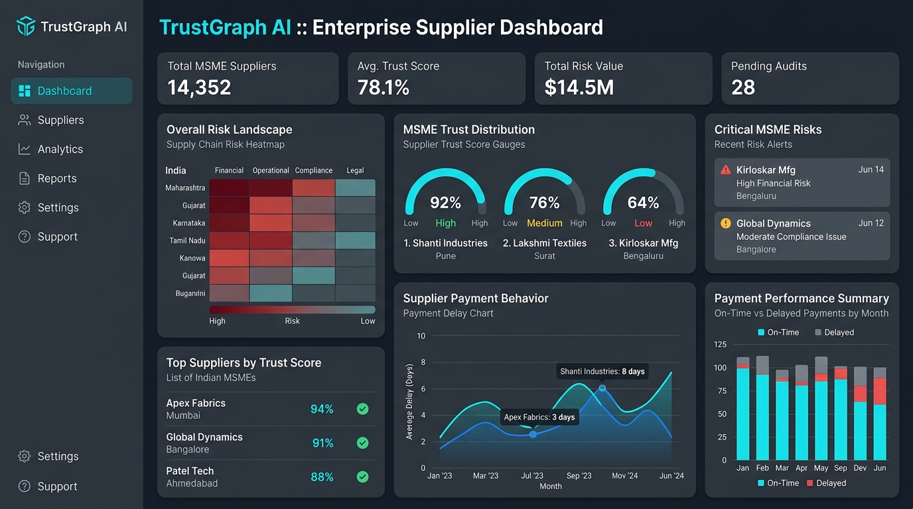
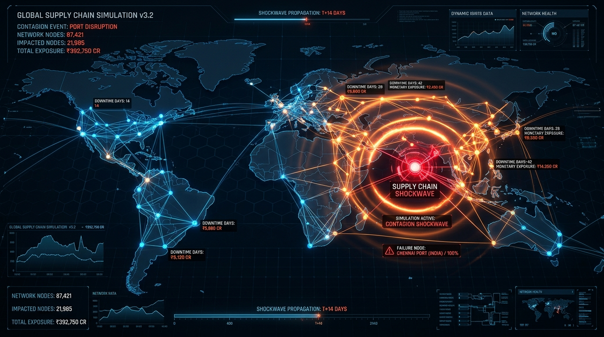
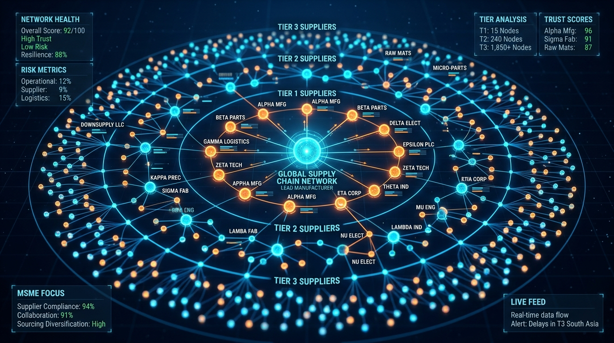

# TrustGraph AI

**Official Repository:** [https://github.com/cksakthiram2428/trust_graph_AI-version-2](https://github.com/cksakthiram2428/trust_graph_AI-version-2)

**Enterprise-Grade 3D Immersive Supply Chain Knowledge Graph & Contagion Shockwave Simulation Platform for Indian MSMEs**


*Figure 1: TrustGraph AI Landing Dashboard showcasing real-time neural monitoring and contagion risk alerts.*

TrustGraph AI is an advanced intelligence and risk mitigation command engine built to protect Indian MSMEs (Micro, Small, and Medium Enterprises) against multi-tier supplier defaults, delayed payments under the MSMED Act 2006, operational insolvencies, and ripple shocks across critical manufacturing supply corridors.

---

## 🚀 Platform Modules & Website Walkthrough

### 1. Active Neural Monitoring Dashboard

*Figure 2: Comprehensive Risk Dashboard showing total risk exposure, MSMEs protected, capital shielded, and real-time contagion alerts.*

The central nervous system of TrustGraph AI. Provides executives with a real-time snapshot of compounding exposure, active suppliers, and predictive accuracy. It automatically triggers emergency alerts (e.g., dual-sourcing interventions) when critical default hazards are detected.

### 2. 3D Spatial Knowledge Graph

*Figure 3: Immersive 3D Spatial Knowledge Graph visualizing multi-tier supplier dependencies.*

Interactive Three.js concentric orbit topology visualizing the supply chain across multiple tiers:
* **Core Hub**: The primary enterprise.
* **Tier-1**: Direct Partners.
* **Tier-2**: Sub-Assembly / Component Fabricators.
* **Tier-3**: Raw Material Suppliers.
Allows for visual tracing of cascading dependencies and physical rotation in a 3D grid space.

### 3. Active Supplier Trust Roster

*Figure 4: Active Supplier Trust Roster evaluating payment lag and statutory verifications.*

A comprehensive grid of all suppliers, complete with real-time AI synchronized Trust Scores (0-100). It highlights payment delays (in days), fulfillment reliability, and quality rates, alongside simulated risk rationales to help procurement teams make data-driven decisions.

### 4. Telemetry Radar & Shockwave Simulation

*Figure 5: Real-time Telemetry Radar and Systemic Contagion Defense.*

Models multi-tier cascading failure simulations and production downtime days. Evaluates compounding exposure via statutory Udyam verification and MSMED Act 2006 Section 15/16 interest liability algorithms.

### 5. Enterprise Command Login (OAuth & Firebase)

*Figure 6: TrustGraph AI Authentication Portal integrated with Firebase Firestore & OAuth 2.0.*

Secure entry point featuring Firebase Authentication. Supports Sign-in with Google, Microsoft, and GitHub. Incorporates Zero-Trust ABAC Security, Firestore Rule Partitioning, and Encrypted Token Exchange to protect highly sensitive procurement telemetry and active operator tracking.

---

## 📊 Data Credibility & Regulatory Compliance Disclosure

To ensure complete regulatory integrity, legal compliance, and market credibility, TrustGraph AI strictly separates **Real-world Government Public Data** from **Algorithmically Simulated Operational Metrics**:

### 1. Real Public Government Data Sources (`dataSource: "real_registration"`)
The following fields are directly extracted and cross-referenced from verified public Indian statutory and government portals:
* **Udyam Registration Portal (Ministry of MSME / data.gov.in)**: Official Enterprise Name, Udyam Registration Certificate Number, Enterprise Classification Category, NIC Codes.
* **Ministry of Corporate Affairs (MCA21 Portal)**: Corporate Identity Number (CIN), Company Legal Incorporation Date.
* **GSTN Public Search**: 15-character Goods & Services Tax Identification Number (GSTIN).

### 2. Algorithmically Simulated Risk Metrics (`dataSource: "simulated_metrics"`)
Because statutory registries only maintain metadata, the following metrics are **explicitly generated via TrustGraph AI's forensic risk model**:
* **Trust Score (0–100)**: Multi-factor composite index evaluating capital concentration and single-source dependency.
* **Payment Delay Averages**: Simulated historical settlement lag.
* **Systemic Contagion Shockwaves**: Multi-tier cascading failure simulations computed via high-thinking AI reasoning engines.

---

## ⚡ Core Technologies

* **Frontend**: React 19, Vite, Tailwind CSS v4, Framer Motion
* **3D Visualization**: Three.js, React Three Fiber
* **Backend & Real-time Database**: Firebase Auth, Firebase Firestore (Real-time sync)
* **AI Engine**: Google Generative AI (Gemini Flash & Pro)
* **API Framework**: Express & Node.js (via `tsx` / `esbuild`)

---

## 🛠️ Data Ingestion Pipeline & Admin Tools

To import real-world MSME CSV datasets from data.gov.in via the command line:

```bash
# Execute the MSME ingestion script
node backend/scripts/importMsmeData.js path/to/udyam_dataset.csv
```

Or use the **Ingest Udyam CSV** button directly inside the **Supplier Grid** admin view.

### AI Copilot
The built-in multi-turn AI Copilot supports dynamic switching between `gemini-3.5-flash` and `gemini-3.1-pro-preview`. It features Google Search Grounding for live market alerts, and a Deep Reasoner mode (`ThinkingLevel.HIGH`) for complex systemic insolvency path modeling.
